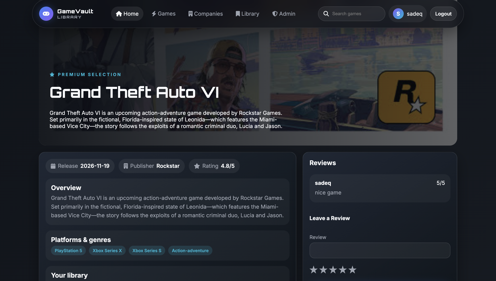
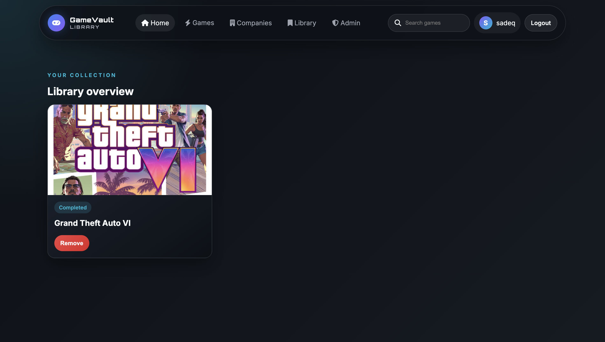
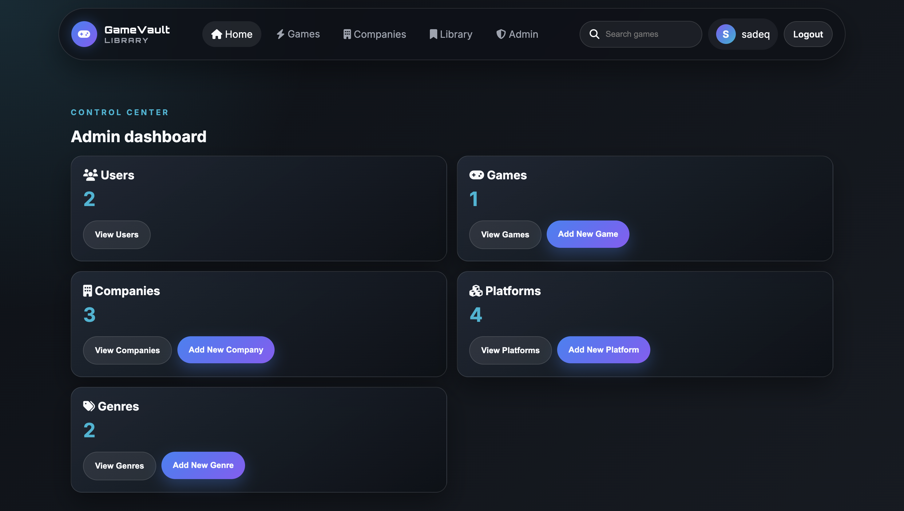
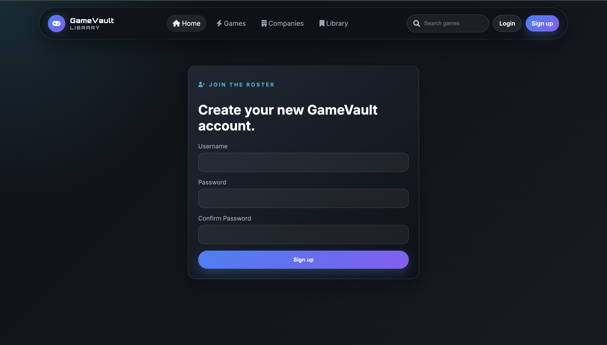
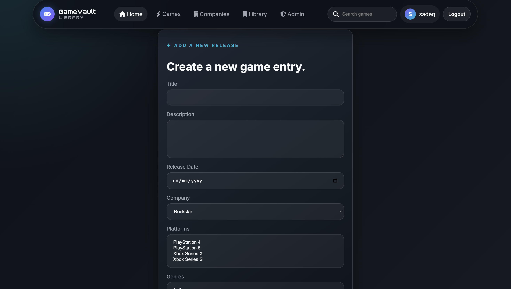

# 🎮 Game Library

## Overview

Game Library is a full-stack web application that allows users to discover, organize, and manage their favorite video games in one place.

Users can browse games, add titles to their personal library, leave reviews, and organize games based on their playing status. The application also includes an administrator dashboard for managing games, companies, genres, and platforms.

---

## Screenshots


- Home Page

- Game Details

- User Library

- Admin Dashboard

- Login & Register

- Create/Edit Game


---

## Technologies Used

### Frontend
- HTML5
- CSS3
- JavaScript
- EJS

### Backend
- Node.js
- Express.js

### Database
- MongoDB
- Mongoose

### Authentication & Security
- Express Session
- Connect Mongo
- bcrypt

### Other Packages
- Morgan
- Method Override
- Dotenv

---

## Getting Started

### Live Demo

```
https://game-vault-library.onrender.com
```

### Planning Materials

Add your planning documents here:

- Trello Board
- ERD
- Wireframes

---

## Installation

Clone the repository:

```bash
git clone https://github.com/yourusername/game-library.git
```

Move into the project directory:

```bash
cd game-library
```

Install dependencies:

```bash
npm install
```

Create a `.env` file and add:

```env
PORT=3000
MONGODB_URI=your_mongodb_connection
SESSION_SECRET=your_session_secret
```

Run the application:

```bash
npm run dev
```

or

```bash
npm start
```

---

## User Stories

### Guest

- Register a new account.
- Login securely.
- Browse available games.
- View game details.

### User

- Add games to a personal library.
- Change game status:
  - Wishlist
  - Playing
  - Completed
- Leave reviews.
- Remove games from the library.

### Administrator

- Create games.
- Edit games.
- Delete games.
- Manage companies.
- Manage platforms.
- Manage genres.

---

## Database Design

### Collections

#### Users

- username
- password
- isAdmin

#### Games

- title
- description
- releaseDate
- coverImage
- company
- genres
- platforms
- reviews

#### Companies

- name
- country
- description
- logo

#### Platforms

- name
- logo
- manufacturer

#### Genres

- name
- description

#### Reviews

- reviewBody
- star
- createdBy

#### Library

- user
- game
- status

---

## Routes

### Authentication

| Method | Route | Description |
|---------|-------|-------------|
| GET | /auth/sign-up | Register page |
| POST | /auth/sign-up | Create account |
| GET | /auth/sign-in | Login page |
| POST | /auth/sign-in | Login user |
| GET | /auth/sign-out | Logout |

### Home

| Method | Route | Description |
|---------|-------|-------------|
| GET | / | Home page |

### Games

| Method | Route | Description |
|---------|-------|-------------|
| GET | /games | View all games |
| GET | /games/:id | View game details |
| POST | /games/:id/reviews | Add review |

### Library

| Method | Route | Description |
|---------|-------|-------------|
| GET | /library | User library |
| POST | /library | Add game to library |
| PUT | /library/:id | Update game status |
| DELETE | /library/:id | Remove game from library |

### Admin

| Method | Route | Description |
|---------|-------|-------------|
| GET | /admin | Dashboard |
| GET | /admin/games/new | New game form |
| POST | /admin/games | Create game |
| GET | /admin/games/:id/edit | Edit game |
| PUT | /admin/games/:id | Update game |
| DELETE | /admin/games/:id | Delete game |
| GET | /admin/companies | Manage companies |
| GET | /admin/platforms | Manage platforms |
| GET | /admin/genres | Manage genres |

---

## Features

- Secure user authentication.
- Admin dashboard.
- CRUD operations for games.
- CRUD operations for companies.
- CRUD operations for platforms.
- CRUD operations for genres.
- Personal game library.
- Game reviews with ratings.
- Responsive user interface.
- MongoDB relationships using Mongoose population.

---

## Future Enhancements

- Search functionality.
- Advanced filtering.
- Pagination.
- User profile pages.
- Favorite games.
- Average game ratings.
- Image uploads using Cloudinary.
- Dark mode.
- Recently played games.
- Game recommendations.
- Email verification.
- Password reset.
- Responsive mobile optimization.

---

## Credits

### Developed By

Sadeq Ali

### Resources

- MongoDB
- Mongoose
- Express.js
- Node.js
- EJS
- MDN Web Docs
- Stack Overflow